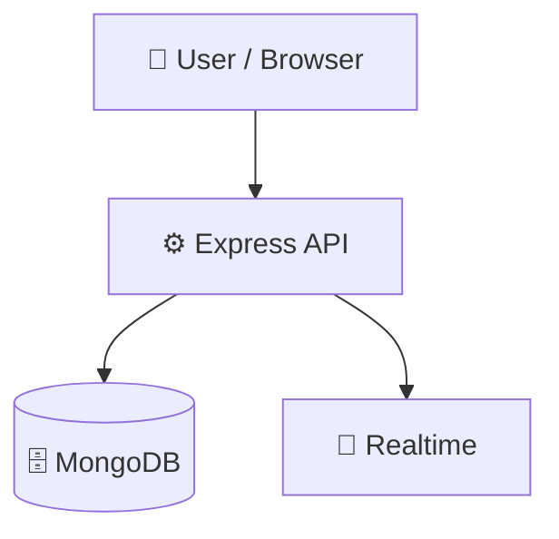

# Gradely

      

## 📑 Table of Contents

- [Description](#description)
- [Tech Stack](#tech-stack)
- [Architecture](#architecture)
- [Quick Start](#quick-start)
- [Environment Variables](#environment-variables)
- [Key Dependencies](#key-dependencies)
- [Available Scripts](#available-scripts)
- [API Endpoints](#api-endpoints)
- [Project Structure](#project-structure)
- [Development Setup](#development-setup)
- [Testing](#testing)
- [Deployment](#deployment)
- [Contributors](#contributors)
- [Contributing](#contributing)

## 📝 Description

Gradely — a backend api built with Docker, Express.js, MongoDB, Redis, Tailwind CSS, TypeScript, Vite.

## 🛠️ Tech Stack

      

**Notable libraries:** Mongoose, Socket.IO, Vitest, Zod

## 🏗️ Architecture

A high-level view of how the main pieces fit together:



## ⚡ Quick Start

```bash

# 1. Clone the repository
git clone https://github.com/AnishCoder2006/Gradely.git

# 2. Install dependencies
npm install

# 3. Configure environment
cp .env.example .env   # then fill in the values

# 4. Start the dev server
npm run dev
```

## 🔑 Environment Variables

The following environment variables are required (see `.env.example`):

```bash
JWT_SECRET=
JWT_EXPIRES_IN=
RAZORPAY_KEY_ID=
RAZORPAY_KEY_SECRET=
RAZORPAY_WEBHOOK_SECRET=
```

## 📦 Key Dependencies

```
@socket.io/redis-adapter: ^8.3.0
bcryptjs: ^3.0.3
cors: ^2.8.6
dotenv: ^16.6.1
express: ^4.22.2
express-rate-limit: ^8.5.2
express-rate-limiter: ^1.3.1
helmet: ^7.2.0
jsonwebtoken: ^9.0.3
kafkajs: ^2.2.4
mongoose: ^8.24.0
morgan: ^1.11.0
otplib: ^12.0.1
pino: ^9.7.0
pino-http: ^10.4.0
```

## 🚀 Available Scripts

- **dev** — `npm run dev`
- **build** — `npm run build`
- **start** — `npm run start`
- **type-check** — `npm run type-check`
- **lint** — `npm run lint`
- **test** — `npm run test`
- **test:watch** — `npm run test:watch`
- **test:coverage** — `npm run test:coverage`

## 🌐 API Endpoints

Detected endpoints (best-effort scan):

```
POST /api/payments/webhook
GET /api/health
GET /
POST /
DELETE /:id
GET /summary/:studentId
POST /mark
```

## 📁 Project Structure

```
.
├── .env.example
├── docker-compose.yml
├── frontendSkill.md
├── student-record-backend
│   ├── Dockerfile
│   ├── eslint.config.js
│   ├── package.json
│   ├── src
│   │   ├── app.test.ts
│   │   ├── app.ts
│   │   ├── config
│   │   │   ├── db.ts
│   │   │   └── logger.ts
│   │   ├── controllers
│   │   │   ├── announcement.controller.ts
│   │   │   ├── attendance.controller.ts
│   │   │   ├── auditLog.controller.ts
│   │   │   ├── auth.controller.test.ts
│   │   │   ├── auth.controller.ts
│   │   │   ├── course.controller.ts
│   │   │   ├── doubt.controller.ts
│   │   │   ├── fee.controller.ts
│   │   │   ├── grade.controller.ts
│   │   │   ├── payment.controller.test.ts
│   │   │   ├── payment.controller.ts
│   │   │   ├── student.controller.ts
│   │   │   └── user.controller.ts
│   │   ├── dtos
│   │   │   ├── course.dto.ts
│   │   │   └── student.dto.ts
│   │   ├── middleware
│   │   │   ├── auth.middleware.test.ts
│   │   │   ├── auth.middleware.ts
│   │   │   ├── cache.middleware.ts
│   │   │   ├── error.middleware.ts
│   │   │   ├── rateLimit.middleware.ts
│   │   │   └── rbac.middleware.test.ts
│   │   ├── models
│   │   │   ├── Announcement.ts
│   │   │   ├── Attendance.ts
│   │   │   ├── AuditLog.ts
│   │   │   ├── Course.ts
│   │   │   ├── Doubt.ts
│   │   │   ├── Fee.ts
│   │   │   ├── Grade.ts
│   │   │   ├── Payment.ts
│   │   │   ├── ProcessedEvent.ts
│   │   │   ├── Student.ts
│   │   │   └── User.ts
│   │   ├── routes
│   │   │   ├── announcement.routes.ts
│   │   │   ├── attendance.routes.ts
│   │   │   ├── auditLog.routes.ts
│   │   │   ├── auth.routes.ts
│   │   │   ├── course.routes.ts
│   │   │   ├── doubt.routes.ts
│   │   │   ├── fee.routes.ts
│   │   │   ├── grades.routes.ts
│   │   │   ├── payment.routes.ts
│   │   │   ├── student.routes.ts
│   │   │   └── user.routes.ts
│   │   ├── server.ts
│   │   ├── services
│   │   │   ├── audit.service.ts
│   │   │   ├── kafka.service.test.ts
│   │   │   ├── kafka.service.ts
│   │   │   ├── redis.service.test.ts
│   │   │   └── redis.service.ts
│   │   ├── socket.ts
│   │   ├── test
│   │   │   ├── mongo.ts
│   │   │   └── setup.ts
│   │   ├── types
│   │   │   └── response.types.ts
│   │   └── utils
│   │       ├── gradeUtils.test.ts
│   │       └── gradeUtils.ts
│   ├── tsconfig.json
│   └── vitest.config.ts
└── student-record-management
    ├── Dockerfile
    ├── eslint.config.js
    ├── index.html
    ├── nginx.conf
    ├── package.json
    ├── postcss.config.js
    ├── public
    │   └── favicon.ico
    ├── src
    │   ├── App.tsx
    │   ├── components
    │   │   ├── auth
    │   │   │   └── MfaModal.tsx
    │   │   ├── common
    │   │   │   ├── Button.tsx
    │   │   │   ├── Input.tsx
    │   │   │   ├── Modal.tsx
    │   │   │   ├── Pagination.tsx
    │   │   │   └── Table.tsx
    │   │   ├── dashboard
    │   │   │   └── StatCard.tsx
    │   │   ├── grades
    │   │   │   └── AddGradeModal.tsx
    │   │   └── layout
    │   │       ├── AppLayout.tsx
    │   │       ├── Footer.tsx
    │   │       ├── Header.tsx
    │   │       ├── RoleSidebar.tsx
    │   │       ├── Sidebar.tsx
    │   │       └── SidebarToggle.tsx
    │   ├── context
    │   │   ├── AuthContext.tsx
    │   │   ├── SocketContext.tsx
    │   │   ├── ThemeContext.tsx
    │   │   ├── ToastContext.tsx
    │   │   └── hooks
    │   │       ├── index.ts
    │   │       ├── useAttendance.ts
    │   │       ├── useCourses.ts
    │   │       ├── useDebounce.ts
    │   │       ├── useGrades.ts
    │   │       ├── useLocalStorage.ts
    │   │       ├── usePagination.ts
    │   │       ├── useStudents.ts
    │   │       └── useToast.ts
    │   ├── main.tsx
    │   ├── pages
    │   │   ├── AnnouncementsPage.tsx
    │   │   ├── AttendancePage.tsx
    │   │   ├── AuthPage.tsx
    │   │   ├── CoursesPage.tsx
    │   │   ├── DashboardPage.tsx
    │   │   ├── DoubtsPage.tsx
    │   │   ├── GradesPage.tsx
    │   │   ├── NotFoundPage.tsx
    │   │   ├── SettingsMfaSection.tsx
    │   │   ├── SettingsPage.tsx
    │   │   ├── SettingsShared.tsx
    │   │   ├── StudentProfilePage.tsx
    │   │   ├── StudentsPage.tsx
    │   │   ├── admin
    │   │   │   ├── AdminAuditLogsPage.tsx
    │   │   │   ├── AdminPaymentsPage.tsx
    │   │   │   ├── AdminStudentApprovePage.tsx
    │   │   │   └── AdminTeacherAssignPage.tsx
    │   │   ├── index.ts
    │   │   ├── student
    │   │   │   ├── MyAttendancePage.tsx
    │   │   │   ├── MyGradesPage.tsx
    │   │   │   ├── MyProfilePage.tsx
    │   │   │   ├── MyProgressPage.tsx
    │   │   │   ├── PaymentPage.tsx
    │   │   │   ├── PendingApprovalPage.tsx
    │   │   │   └── StudentDashboard.tsx
    │   │   └── teacher
    │   │       ├── MyCoursesPage.tsx
    │   │       ├── TeacherAttendancePage.tsx
    │   │       ├── TeacherMyStudentsPage.tsx
    │   │       └── TeacherRequestCoursePage.tsx
    │   ├── router
    │   │   ├── AppRouter.tsx
    │   │   └── RoleRouter.tsx
    │   ├── services
    │   │   ├── announcementService.ts
    │   │   ├── api.ts
    │   │   ├── attendanceService.ts
    │   │   ├── courseService.ts
    │   │   ├── doubtService.ts
    │   │   ├── gradeService.ts
    │   │   ├── index.ts
    │   │   ├── paymentService.ts
    │   │   └── studentService.ts
    │   ├── store
    │   │   ├── authSlice.ts
    │   │   ├── baseApi.ts
    │   │   ├── hooks.ts
    │   │   ├── index.ts
    │   │   └── store.ts
    │   ├── styles
    │   │   ├── animations.css
    │   │   ├── components.css
    │   │   ├── globals.css
    │   │   ├── layout.css
    │   │   ├── tyrography.css
    │   │   └── variables.css
    │   ├── types
    │   │   ├── attendance.types.ts
    │   │   ├── auth.types.ts
    │   │   ├── common.types.ts
    │   │   ├── course.types.ts
    │   │   ├── grade.types.ts
    │   │   ├── index.ts
    │   │   └── student.types.ts
    │   └── utils
    │       ├── gradeUtils.ts
    │       └── pdfExport.ts
    ├── tailwind.config.js
    ├── tsconfig.json
    └── vite.config.ts
```

## 🛠️ Development Setup

### Node.js / JavaScript
1. Install Node.js (v18+ recommended)
2. Install dependencies: `npm install` (or `yarn` / `pnpm install` / `bun install`)
3. Start the dev server: see the **Quick Start** above

### Docker
1. `docker build -t my-app .`
2. `docker run -p 3000:3000 my-app`

## 🧪 Testing

This project uses **Vitest** for testing.

```bash
npm run test
```

## 🚢 Deployment

### Docker
```bash
docker build -t gradely .
docker run -p 3000:3000 gradely
```

### Docker Compose
```bash
docker compose up -d
```

> ⚙️ CI/CD is configured via GitHub Actions (see `.github/workflows/`).

## 👥 Contributing

Contributions are welcome! Here's the standard flow:

1. **Fork** the repository
2. **Clone** your fork: `git clone https://github.com/AnishCoder2006/Gradely.git`
3. **Branch**: `git checkout -b feature/your-feature`
4. **Commit**: `git commit -m 'feat: add some feature'`
5. **Push**: `git push origin feature/your-feature`
6. **Open** a pull request

Please follow the existing code style and include tests for new behavior where applicable.

---

<div align="center">


</div>
